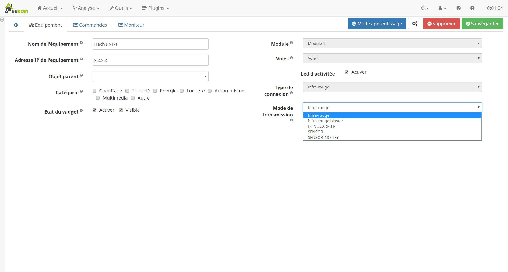
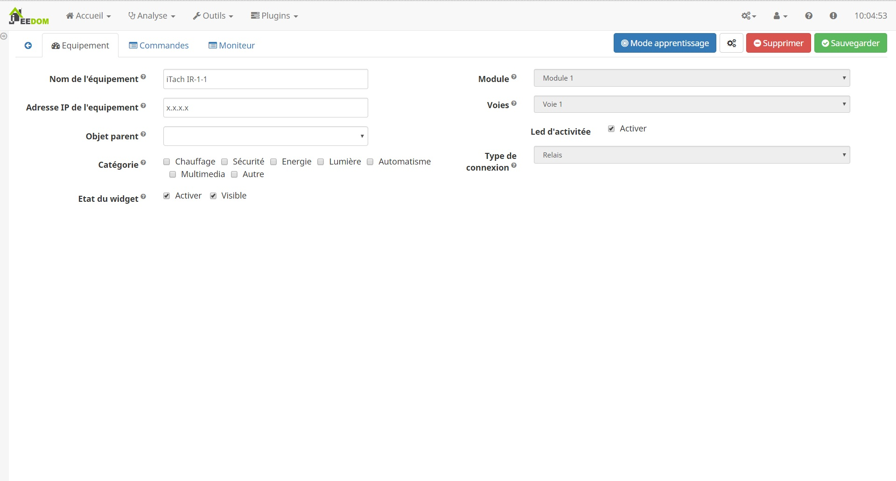

Description
====
Ce plugin a pour but de connecter jeedom à vos équipements __global cache__.

Installation et configuration
====
Il n'y a besoin d'aucune installation ou configuration particuliere pour utilisé ce plugin

Recheche des équipements
====

Le plugin est doté d'une decouverte de vous global cache sur votre reseau avec une auto-configuration
Vous avez juste a cliquer sur le bouton "Lancer Scan"

Si vous avez plusieur global cache sur votre reséau, il vous faudra répéter l'operation

Paramettrage spécifique
====
En fonction du model que vous disposez, vous serez ammené a configurer les differents modules
Le module, la voie ainsi que le type est parametrer par le plugin, il n'est donc pas possible de le modifier

Infra-Rouge
----

Il faudra choisir le protocole d'echange de votre equipement a piloté
* Infra-rouge
* Infra-rouge blaster
* IR_NOCARRIER
* SENSOR
* SENSOR_NOTIFY

Maintenant, que notre voie est configurer, on vas sauvgarder ses parametres qui seront envoye a votre global cache.
Nous somme pret a cree une commande.

Pour les iTach, il existe une precedure d'apperentissage (Non tester sur les GC100)

### Mode Manuel

Pour pouvoir configurer une commande en mode manuel il faut avoir la valeur HEXA a envoyer a l'appareil.
Une database global cache est disponible https://irdb.globalcache.com/Home/Database

Le plugin fait le reste

### Mode apprentisstage

Dans un permier temps il faut passé en mode apprentissage (Bouton en haut de la page)
Une fois le mode apprentissage valifé par le globle cache, on peux cliquer sur le bouton "Apprentissage" de notre commande.
Il est possible de repeter cette dernniere manipulation autant de foie que l'on a de commande
Ne pas oublier de sauvgarder et de quitter le mode apprentissage

RS232
----

Pour le mode RS232, il est imperatif d'avoir la documentation de votre appareil relier a votre Global Cache.
On pourra alors a l'aide de celui ci configurer notre liaison serie
* Baudrate
* Type de Flux
* Parité

Maintenant, que notre voie est configurer, on vas sauvgarder ses parametres qui seront envoye a votre global cache.
Nous somme pret a cree une commande.

Pour chaque commande, il sera important de definir le type de codage et sa valeur.
Ses informations sont egalement a retrouver dans la spécification de votre equipement.
Sans oublié de definir s'il faut envoyer un retour de chariot et une nouvelle ligne

Relais
----

Le relais ne necisite pas de configuration particuliere, les commandes seront automatiquement cree
